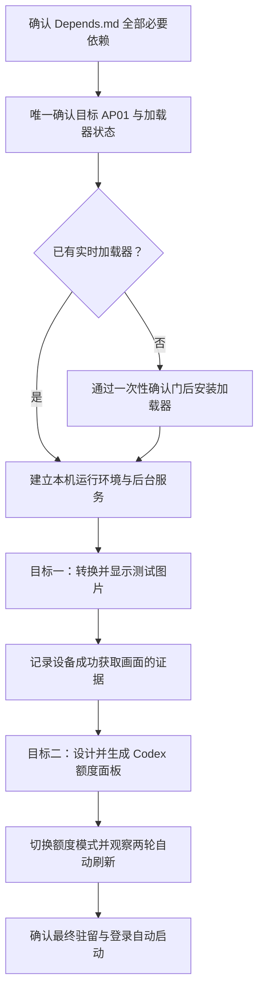

# 本机 AP01 图片与 Codex 额度交付目标

## 1. 文档职责

本文是本次交付的唯一目标依据，只记录目标、范围、执行顺序、验收标准与安全停止条件。软件、硬件、环境、工具和登录依赖统一记录在 `Depends.md`；密码、长期令牌与凭据路径只记录在本机 `.env`。

当前状态：等待用户审阅，尚未创建目标模式。

本次最终状态是：AP01 持续显示由本机自动刷新的 Codex 额度面板。任意图片显示是必须先完成并留下证据的第一阶段验收，不是最终驻留模式。

## 2. 目标一：显示任意图片

### 2.1 交付内容

1. 建立本机画面生成与局域网提供能力。
2. 将一张普通图片转换为 AP01 可安全显示的 320×240 动图容器。
3. 让唯一确认的目标 AP01 主动获取该画面。
4. 保留画面属性、服务状态和设备成功请求记录。

用户未指定图片时，默认使用仓库自带的 CUKTECH Screen Controller 软件展示图；用户提供图片时，以用户图片为准。

### 2.2 画面约束

- 输出尺寸必须是 320×240。
- 文件必须是 GIF89a（AP01 能稳定识别的一种动图文件格式）。
- 至少包含两帧，优先控制在 90 KB 以内。
- 默认采用“完整显示”，深色区域补边；只有画面比例适合时才采用裁切或拉伸。
- 日常换图只写入 RAM（断电后清空的临时内存），不重复写入固件存储。

### 2.3 完成标准

- 本机健康检查返回正常。
- 本机画面地址返回有效的 320×240、至少两帧的 GIF89a。
- 后台日志出现目标 AP01 成功获取画面的 `GET /screen.gif 200` 记录。
- 记录实际图片尺寸、帧数、字节数和设备请求时间。

## 3. 目标二：设计并显示本机 Codex 额度

### 3.1 数据来源

通过本机已登录的 Codex 官方后台接口读取额度，不截屏、不识别界面文字，也不要求用户复制账户凭据。只把额度百分比、重置时间和生成时间等已清理数据写入本地产物。

### 3.2 默认设计

- 320×240 深色高对比信息面板。
- 顶部 40 行为 AP01 原有时钟与日期覆盖层预留空间。
- 主视觉使用 Codex 青蓝色。
- 主要显示短周期剩余额度与本周剩余额度。
- 同时显示对应重置时间和本次更新时间。
- 剩余额度不高于 10% 时使用醒目的警示色。
- 使用四帧低复杂度微动效果，优先控制在 90 KB 以内。

### 3.3 刷新与容错

- 电脑默认每 300 秒读取一次 Codex 额度并重新生成面板。
- AP01 按自身轮询周期获取最新画面。
- 某次额度读取失败时保留上一张成功画面，不能用错误页覆盖屏幕。
- 电脑保持开机且用户保持登录时，后台服务持续运行。
- 设置当前用户登录后自动启动后台服务。

### 3.4 完成标准

- 能读取当前 Codex 账户的有效额度数据。
- 设计母版、屏幕预览和设备动图均成功生成。
- 设备动图满足 320×240、至少两帧和体积限制。
- 本机健康检查显示最近一次额度刷新成功。
- 至少观察到两次相邻的自动刷新，证明定时任务持续工作。
- 第二次刷新后，后台日志仍能确认目标 AP01 成功获取最新画面。
- 最终驻留模式为 Codex 额度面板。

## 4. 执行顺序

目标一未通过时，不进入目标二。设备身份、型号或固件不能可靠确认时，不进入固件安装。

## 5. 原厂屏幕的一次性确认门

如果只读检查证明 AP01 已经具备实时加载器，整个交付可以无人值守完成，并且不会执行 OTA（通过网络安装固件）。

如果 AP01 是完全原厂状态，则只能对型号 `njcuk.enstor.ap01`、固件 `1.0.2_0031` 继续。Agent 必须先完成镜像构建与全部文件指纹、文件头、写入位置和回读校验，然后在真正安装前向用户展示结果并取得明确确认。该确认不能提前授权，也不能因为用户暂时离线而省略。

原厂屏幕无法在用户整晚不响应的情况下完成首次固件安装。等待确认期间允许完成运行环境、测试画面、额度面板设计和离线验证，但不得向设备安装固件。

## 6. 安全与停止条件

- 不猜测目标设备身份、固件版本或写入位置。
- 不向已经具备实时加载器的 AP01 重复安装固件。
- 不把米家凭据、设备编号、临时固件地址、固件文件或账户登录材料写入仓库。
- 不修改充电功率、充电端口、充电策略或其他基站控制功能。
- 任何设备身份冲突、网络隔离、额度读取失败或固件校验失败都必须保留证据并停止对应高风险步骤。
- 只有本机进程退出不能证明交付失败或成功；以健康检查、有效画面和 AP01 成功请求记录为准。

## 7. 目标模式启动条件

只有同时满足以下条件时才创建目标模式：

- 用户已经审阅并认可 `Goal.md`；
- `Depends.md` 中的必填依赖已经满足；
- 需要的登录已经在当前电脑完成并可复用；
- 目标 AP01 可以被唯一识别；
- 用户理解原厂固件的一次性确认门。

目标模式创建后，目标描述为：

> 在本机为唯一确认的酷态科 AP01 建立稳定的局域网画面链路；先完成并验证任意图片显示，再设计、部署并持续验证每 300 秒刷新一次的本机 Codex 额度面板，最终保留额度面板与登录自动启动；严格遵守原厂固件的一次性确认门。
