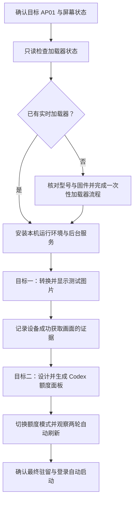

# 本机 AP01 图片与 Codex 额度交付目标

## 1. 文档地位

本文是本次本机交付的目标与验收依据。用户审阅并明确同意后，Agent 才创建目标模式并开始安装、配置、设备连接与验证。

本次最终状态是：AP01 持续显示由本机自动刷新的 Codex 额度面板。任意图片显示是必须先完成并留下证据的第一阶段验收，不是最终驻留模式。

## 2. 已确认的当前状态

- 电脑是符合要求的 Apple Silicon macOS 14.6.1（苹果芯片与苹果电脑系统版本）。
- 本机 Codex 已通过 ChatGPT 账户登录，可以作为额度数据来源。
- 电脑已经取得家庭局域网地址，当前网络路径可用。
- 项目隔离运行环境尚未安装。
- Bridge（在电脑上生成并提供屏幕画面的后台服务）尚未运行，也未设置登录后自动启动。
- 尚未生成本机屏幕文件。
- 尚无 AP01 成功获取 `/screen.gif`（屏幕固定画面地址）的日志证据。
- 同一局域网发现多个米家协议响应设备，目前不能仅凭广播安全确定目标 AP01。
- 本机没有可供工具读取的米家登录状态。
- 本机尚未安装米家 App（米家电脑应用）。
- 已建立仅保存在本机的 `.env.local`（本地环境变量文件），并加入 Git（代码版本记录工具）忽略规则；任何密码或长期账户令牌只能写入该文件或应用自身的安全登录存储。

以上状态只用于确定下一步，不代表 AP01 是否已经安装实时加载器。

## 3. 目标一：显示任意图片

### 3.1 交付内容

1. 安装项目运行环境与本机后台服务。
2. 将一张普通图片转换为 AP01 可安全显示的 320×240 动图容器。
3. 在本机提供该画面，并让目标 AP01 主动获取。
4. 保留生成物属性、服务状态和设备成功请求记录。

用户未指定图片时，默认使用仓库自带的 CUKTECH Screen Controller 软件展示图作为测试图片；用户提供图片时，以用户图片为准。

### 3.2 画面约束

- 输出尺寸必须是 320×240。
- 文件必须是 GIF89a（AP01 能稳定识别的一种动图文件格式）。
- 至少包含两帧，优先控制在 90 KB 以内。
- 默认采用“完整显示”，深色区域补边；只有画面比例适合时才采用裁切或拉伸。
- 日常换图只写入 RAM（断电后清空的临时内存），不重复写入固件存储。

### 3.3 完成标准

- 本机健康检查返回正常。
- 本机画面地址返回有效的 320×240、至少两帧的 GIF89a。
- 后台日志出现目标 AP01 成功获取画面的 `GET /screen.gif 200` 记录。
- 记录实际图片尺寸、帧数、字节数和设备请求时间。

## 4. 目标二：设计并显示本机 Codex 额度

### 4.1 数据来源

通过本机已登录的 Codex 官方后台接口读取额度，不截屏、不识别界面文字，也不要求用户复制账户凭据。只把额度百分比、重置时间和生成时间等已清理数据写入本地产物。

### 4.2 默认设计

- 320×240 深色高对比信息面板。
- 顶部 40 行为 AP01 原有时钟与日期覆盖层预留空间。
- 主视觉使用 Codex 青蓝色。
- 主要显示短周期剩余额度与本周剩余额度。
- 同时显示对应重置时间和本次更新时间。
- 剩余额度不高于 10% 时使用醒目的警示色。
- 使用四帧低复杂度微动效果，优先控制在 90 KB 以内。

### 4.3 刷新与容错

- 电脑默认每 300 秒读取一次 Codex 额度并重新生成面板。
- AP01 按自身轮询周期获取最新画面。
- 某次额度读取失败时保留上一张成功画面，不能用错误页覆盖屏幕。
- 电脑保持开机且用户保持登录时，后台服务持续运行。
- 设置当前用户登录后自动启动后台服务。

### 4.4 完成标准

- 能读取当前 Codex 账户的有效额度数据。
- 设计母版、屏幕预览和设备动图均成功生成。
- 设备动图满足 320×240、至少两帧和体积限制。
- 本机健康检查显示最近一次额度刷新成功。
- 至少观察到两次相邻的自动刷新，证明定时任务持续工作。
- 第二次刷新后，后台日志仍能确认目标 AP01 成功获取最新画面。
- 最终驻留模式为 Codex 额度面板。

## 5. 两个目标的执行顺序

目标一未通过时，不进入目标二。设备身份、型号或固件不能可靠确认时，不进入固件安装。

## 6. 需要用户一次性提供或确认的内容

请在审阅本文后，一次回复以下内容：

1. **屏幕既往状态**：这块 AP01 是否曾经显示过电脑提供的自定义图片、动图或额度面板；回答“显示过”“从未显示过”或“不确定”。
2. **设备信息截图**：米家中的设备信息页截图，需要看清在线状态、准确型号和当前固件版本；截图不需要包含密码。
3. **现在完成米家登录**：本机尚未安装米家 App。请先在这台 Mac 上安装并打开米家，使用拥有目标 AP01 的同一区域账号登录，确认 AP01 在应用中显示在线，然后保持登录并回复“米家已登录”。如果当前应用商店无法安装米家，请直接告诉 Agent，改走本地凭据文件方案。
4. **设备局域网地址**：尽量提供路由器设备列表中该 AP01 的局域网地址；完成第 3 项后，Agent 也会尝试通过只读米家登录状态自动识别。
5. **网络确认**：确认 AP01 与本机连接同一个非访客、未隔离的家庭局域网，并且 AP01 会在执行期间保持稳定供电和在线。
6. **地址稳定性**：确认已经在路由器中为这台 Mac 设置地址保留，或者同意先使用当前地址完成验证并接受地址变化后需要重新处理连接配置。
7. **测试图片**：可选。若不提供，使用仓库自带的软件展示图。
8. **文档结论**：明确回复“文档无误，可以创建目标并开始执行”，或列出需要修改的内容。

本机 Codex 已登录，不需要用户提供 Codex 密码、会话文件或其他登录材料。

## 7. 本地凭据与登录状态保存

- `.env.local` 已加入忽略规则并设置为仅当前用户可读写。需要密码、长期令牌或本地凭据文件路径时，只写入该文件，不写入普通文档、日志或提交记录。
- Codex 继续使用当前 ChatGPT App（ChatGPT 电脑应用）与命令行工具已经保存的登录状态，不复制账户令牌。
- 米家优先使用米家 App 自身保存的本机登录状态，避免重复登录。只有应用登录状态不能被工具读取时，才使用 `.env.local` 中的米家变量或其中指定的本地凭据文件。
- Agent 执行需要这些变量的命令时，显式加载 `.env.local`；加载过程不得把变量值打印到终端。
- 米家密码、Codex 密码和会话令牌都不要求用户发送到聊天。
- 临时固件下载票据有时效，不能现在生成后留到整晚使用；如确实进入原厂固件安装流程，必须在对应步骤即时生成。

## 8. 原厂屏幕的一次性确认门

如果只读检查证明 AP01 已经具备实时加载器，整个交付可以无人值守完成，并且不会执行 OTA（通过网络安装固件）。

如果 AP01 是完全原厂状态，则只能对型号 `njcuk.enstor.ap01`、固件 `1.0.2_0031` 继续。Agent 必须先完成镜像构建与全部文件指纹、文件头、写入位置和回读校验，然后在真正安装前向用户展示结果并取得明确确认。该确认不能提前授权，也不能因为用户暂时离线而省略。

因此，原厂屏幕无法在用户整晚不响应的情况下完成首次固件安装。等待确认期间允许完成运行环境、测试画面、额度面板设计和离线验证，但不得向设备安装固件。

## 9. 安全与停止条件

- 不猜测目标设备身份、固件版本或写入位置。
- 不向已经具备实时加载器的 AP01 重复安装固件。
- 不把米家凭据、设备编号、临时固件地址、固件文件或账户登录材料写入仓库。
- 不修改充电功率、充电端口、充电策略或其他基站控制功能。
- 任何设备身份冲突、网络隔离、额度读取失败或固件校验失败都必须保留证据并停止对应高风险步骤。
- 只有本机进程退出不能证明交付失败或成功；以健康检查、有效画面和 AP01 成功请求记录为准。

## 10. 目标模式启动条件

只有同时满足以下条件时才创建目标模式：

- 用户已经审阅并认可本文；
- 第 6 节中的必填信息已经提供，且需要的登录已经在当前电脑完成；
- 目标 AP01 可以被唯一识别；
- 用户理解第 8 节的原厂固件确认门。

目标模式创建后，目标描述为：

> 在本机为唯一确认的酷态科 AP01 建立稳定的局域网画面链路；先完成并验证任意图片显示，再设计、部署并持续验证每 300 秒刷新一次的本机 Codex 额度面板，最终保留额度面板与登录自动启动；严格遵守原厂固件的一次性确认门。
