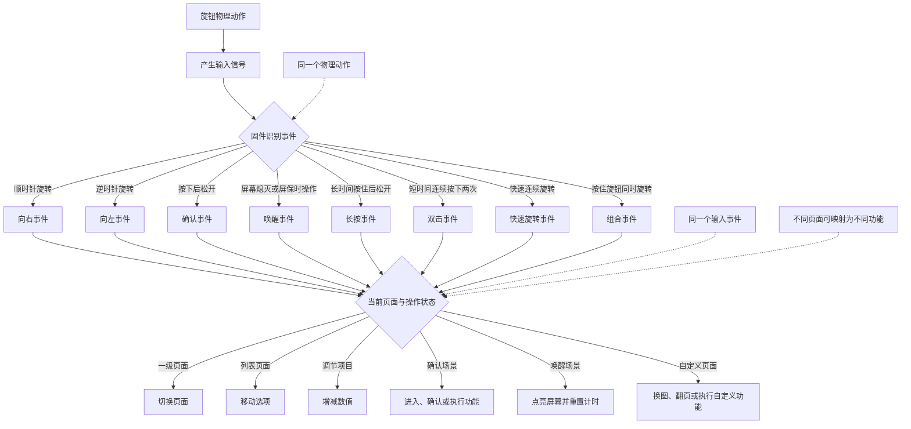

# AP01 物理旋钮动作、事件与功能表

## 1. 使用原则



## 2. 原厂内置

### 2.1 我们如何确认原厂能力

原厂能力以设备对应的官方 `1.0.2_0031` 固件为主要证据，以公开真机体验为交叉验证，不根据普通旋钮的常见用法猜测。

#### 证据来源

1. 项目通过 [`mi_cloud.py`](../../mi_cloud.py) 查询小米官方固件信息并下载与目标型号、版本匹配的原始固件。
2. 原始固件保存在本机 `artifacts/ap01-1.0.2_0031.bin`。`artifacts/` 是被版本库忽略的构建产物目录，因此其他开发者需要自行通过小米官方固件链路取得对应文件，不能从仓库直接下载。
3. 使用 `strings`（从二进制文件中提取可读文字的系统工具）读取固件中的日志文字和程序名称，再用 `rg`（快速筛选文字内容的搜索工具）定位旋钮、按键和页面处理证据：

   ```bash
   strings -a -n 4 artifacts/ap01-1.0.2_0031.bin \
     | rg -i 'encoder|key right|key left|key enter|screen saver|screen off|backlight|lv_page_ui_'
   ```

4. 当前加载器源码 [`realtime_payload/ap01_realtime_payload.c`](../../realtime_payload/ap01_realtime_payload.c) 用于确认我们修改了什么：它继续调用原厂界面定时处理，只把虚拟形象页面的动图来源替换为临时内存中的新图片，没有注册或改写旋钮事件。
5. 公开真机体验用于交叉核对界面结果：[旋转切换一级页面、按下进入二级页面的实测](https://zhuanlan.zhihu.com/p/2051007293286889132)；[时钟、功率、天气和设置页面的实测](https://zhuanlan.zhihu.com/p/2047256620741169793)。公开体验是辅助证据，固件记录才是动作和事件判断的主要依据。

#### 固件中的直接证据

| 固件中的可读记录 | 能确认的事实 |
| --- | --- |
| `Encoder CW`、`Encoder CCW` | 硬件分别识别顺时针和逆时针旋转；`CW`（顺时针方向）、`CCW`（逆时针方向） |
| `Encoder button pressed`、`Encoder button released` | 硬件分别上报按下和松开状态 |
| `key right`、`key left`、`key enter` | 原厂界面把旋钮输入转换为向右、向左和确认三类事件 |
| `j_update_screen_close`、`j_update_screen_saver` 中的 `encoder_flag` | 旋钮输入参与屏幕唤醒、熄屏和屏幕保护计时 |
| `lv_page_ui_time1_create`、`lv_page_ui_power1_create`、`lv_page_ui_weather1_create`、`lv_page_ui_date1_create`、`lv_page_ui_setting_create`、`lv_page_ui_virchar_create` | 固件中存在时钟、功率、天气、日历、设置和虚拟形象页面 |
| 各页面对应的 `key right`、`key left`、`key enter` 处理记录 | 同一个旋钮事件会根据当前页面执行不同功能 |

没有检索到独立的原厂长按、双击或快速旋转事件处理记录。这只能说明原厂当前没有发现这些映射，不代表硬件不能通过按下时长、点击间隔或旋转速度计算出这些事件。

### 2.2 原厂动作、事件与功能表

| 动作 | 事件 | 功能 | 当前支持情况 |
| --- | --- | --- | --- |
| 顺时针旋转一格 | 向右事件 | 一级页面切换到下一页；列表移动到下一项；调节项目增加一级 | 原厂已支持 |
| 逆时针旋转一格 | 向左事件 | 一级页面切换到上一页；列表移动到上一项；调节项目减少一级 | 原厂已支持 |
| 连续旋转多格 | 连续向右或连续向左事件 | 连续翻页、连续移动选项或连续调整数值 | 原厂已支持 |
| 按下后松开 | 确认事件 | 进入二级页面、确认选项、执行开关或进入当前项目 | 原厂已支持 |
| 屏幕熄灭或处于屏幕保护时旋转或按下 | 唤醒事件 | 点亮屏幕并重新计算屏幕保护和熄屏等待时间 | 原厂已支持 |

### 2.3 原厂页面中的现有映射

| 页面 | 旋转功能 | 按下功能 |
| --- | --- | --- |
| 一级页面 | 切换时钟、功率、天气、日历、设置和虚拟形象等页面 | 进入当前页面的二级内容 |
| 时钟页面 | 切换页面或调整当前选项 | 进入时间设置、确认十二小时制或二十四小时制 |
| 功率页面 | 选择端口、模式或设置项 | 查看端口详情、确认模式、控制端口或相关充电功能 |
| 天气页面 | 浏览天气项目 | 进入详细天气 |
| 日历页面 | 翻阅日期或日程 | 进入详细日历 |
| 设置页面 | 选择设置项或调整数值 | 进入并确认亮度、常亮、屏幕保护等设置 |
| 虚拟形象页面 | 切换到相邻的一级页面 | 进入原厂虚拟形象选择内容 |

## 3. 用户自定义

### 3.1 可新增的动作、事件与功能表

| 动作 | 事件 | 功能 | 实现状态 |
| --- | --- | --- | --- |
| 长时间按住后松开 | 长按事件：根据按下到松开的持续时间生成 | 可设置为返回主页、返回上一级、刷新当前页面或打开快捷功能 | 硬件条件具备，等待固件实现 |
| 短时间内连续按下两次 | 双击事件：根据两次确认事件的间隔生成 | 可设置为立即刷新数据、切换常用页面或执行快捷操作 | 可通过固件新增 |
| 快速连续旋转 | 快速旋转事件：根据单位时间内的旋转格数生成 | 可设置为快速翻页、大步调整亮度或切换功能组 | 可通过固件新增 |
| 按住旋钮同时旋转 | 组合事件 | 可设置为调整亮度、切换面板类别或进入管理功能 | 需要真机验证按住期间是否继续上报旋转 |

### 3.2 当前自定义图片的旋钮行为

当前加载器把自定义图片挂载到原厂虚拟形象页面，但没有接管旋钮事件：

- 旋转旋钮仍会离开自定义图片并切换到相邻的原厂页面；
- 按下旋钮仍会进入原厂虚拟形象的二级内容；
- 自定义图片不会因为旋钮动作而切换内容；
- 要实现自定义交互，需要在设备端增加事件处理和页面状态，再把旋钮事件映射到换图、翻页或其他功能。
